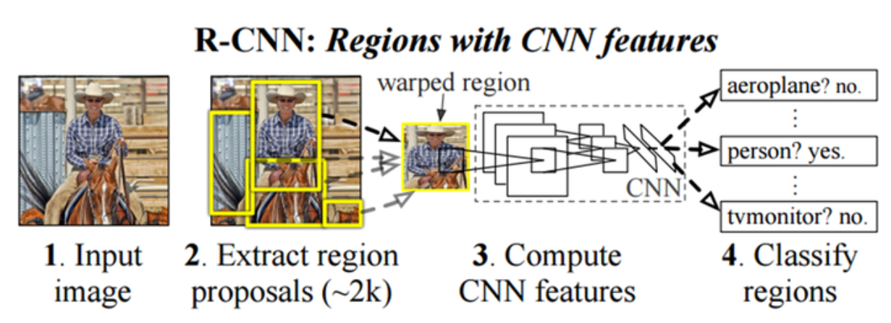
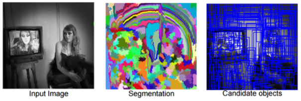
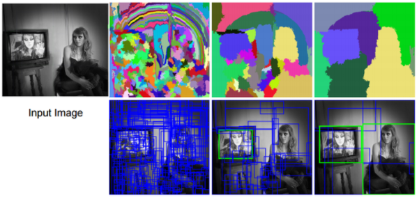
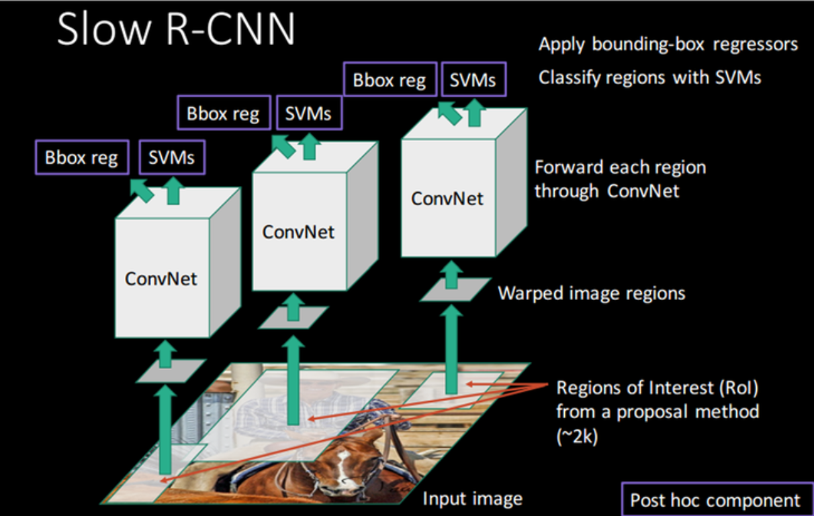
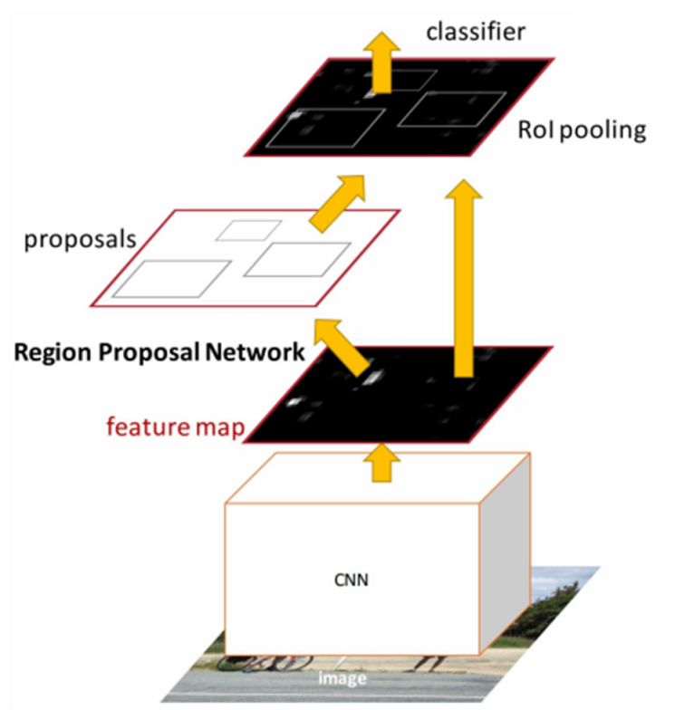
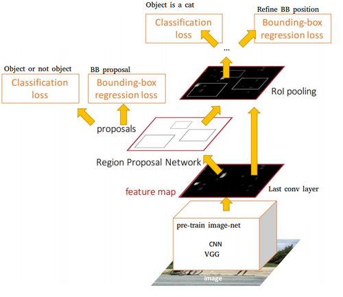
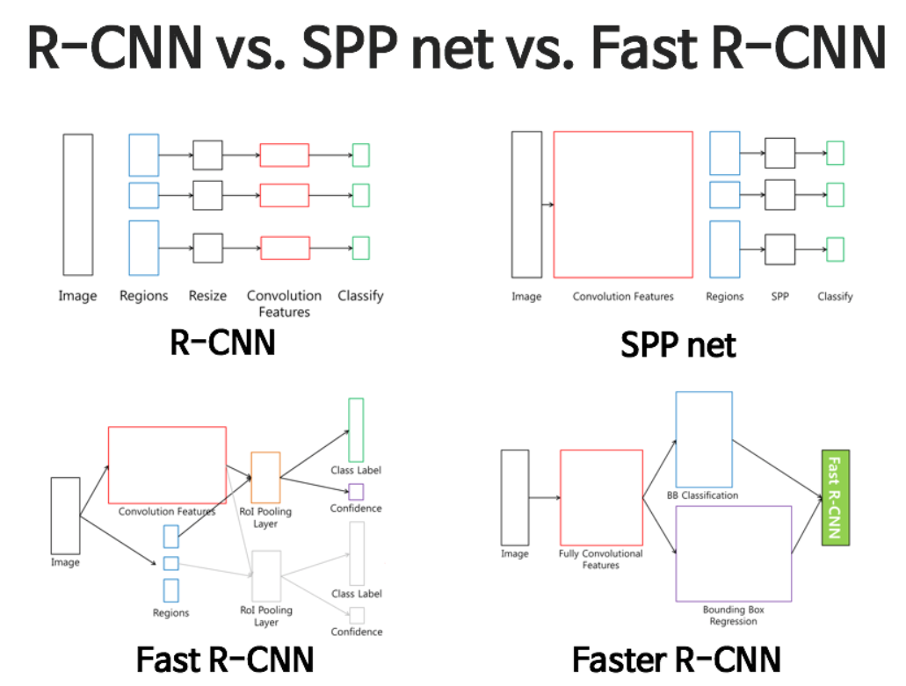

## Object Dectection 1

R-CNN, Fast R-CNN, Faster R-CNN, RFCN, Mask R-CNN

**Object classification**은 영상 내에 특정 대상이 있는지 여부를 밝혀내고자 하는 것이다. 하지만 **object detection**은 영상 내에 특정 대상이 존재하는지 여부를 판단하는 것 뿐만 아니라, 대상의 정확한 위치까지 파악을 하고 bounding box라고 부르는 사각형 영역으로 구분하는 것 까지 수행을 해야 한다.

Object detection은 머신 러닝 관련 지식 뿐만 아니라, 컴퓨터 비젼 관련 지식을 필요로 한다. 2013년 버클리 대학교의 Ross Girshick 팀이 **R-CNN(Regions with CNN features)**이라는 방법을 발표하였다.

### 1. R-CNN(Regions with CNN features)

**Selective Search**

R-CNN 알고리즘이 발표되기 이전에 대부분 object dectection에 주로 사용되던 방법은 SIFT나 HOG에 기반한 알고리즘이었다. SIFT나 HOG는 대부분 영상 내에 존재하는 gradient 성분을 일정 영역으로 나누고 그 경향성을 이용하여 대상을 검출하는 방식을 사용한다.

위 그림과 같이 입력 영상으로부터 약 2000개의 후보 영역을 만든다. 이 때 사용하는 방법은 selective search 방법을 적용하여 후보 영역을 선정한다. Selective search를 통해 후보 영역을 선정하면, AlexNet이 224x224 크기의 이미지를 받아들이도록 되어 있어 해당 영역을 warping 이나 crop을 사용하여 224x224 크기로 만들고, 이것을 AlexNet을 약간 변형한 CNN에 입력하여 최종 출력에서 해당 영상을 대표할 수 있는 CNN feature vector를 얻어낸다. 
그 다음은 linear SVM을 이용해 해당 영역을 분류한다.

R-CNN에서 CNN은 AlexNet을 사용!

R-CNN은 위와 같은 단계로 진행이 된다. 

1) 이미지를 input으로 집어 넣는다.
2) 2000개의 Region proposal을 추출한다.
3) 추출한 Region proposal을 CNN에 흘려보낸다.
4) 그 결과값으로 SVM을 통해 어떤 객체인지 분류한다.
총 세개의 모듈 **Region proposal, CNN, SVM** 이 사용된다.

**Selective Search의 3단계 과정**

1. 처음에 sub-segmentation 수행

2. 작은 영역을 반복적으로 큰 영역으로 통합

    "탐욕(Greedy)" 알고리즘을 사용하며, 우선 여러 영역으로부터 가장 비슷한 영역을 고르고, 이것을 좀 더 큰 영역으로 통합을 하며, 이 과정을 1개의 영역이 남을 때까지 반복을 한다.

3. 통합된 영역들을 바탕으로 후보영역을 만들어 낸다.

#### R-CNN의 문제점

1. 이미지의 warping이나 crop을 사용하는데, 이로 인한 이미지 변형이나 crop으로 인한 손실로 인해, 성능 저하가 일어날 수 있는 요인이 존재한다.
2. 2000여개에 이르는 region proposal에 대해 순차적으로 CNN을 수행해야 하기 때문에 학습이나 실제 runtime이 길다.
3. 사용하는 알고리즘이 특히, region proposal이나, SVM 튜닝 등이 GPU 사용에 적합하지 않다는 것이다.

#### R-CNN의 문제점

1. Training이 여러 단계로 이루어짐

   R-CNN은 크게 3단계 과정으로 이루어진다. 우선 약 2000여개의 후보 영역에 대하여 log loss 사용하여 fine tuning을 한다. 이후 ConvNet 특징을 이용하여 SVM에 대한 fitting 작업을 진행한다. bounding box regressor에 대한 학습을 한다.

2. Training 시간이 길고 대용량 저장 공간이 필요

   SVM과 bounding box regressor의 학습을 위해, 영상의 후보 영역으로부터 feature를 추출하고 그것을 디스크에 저장한다. 

3. 객체 검출(object detection) 속도가 느림

R-CNN의 가장 큰 문제는 모든 객체 후보 영역에 대하여 개별적으로 연산을 한다는 점이며 이것 때문에 속도가 느리다. 

#### Fast R-CNN

Fast R-CNN은 학습 시 multi-stage가 아니라 single-stage로 가능하고, 학습의 결과를 망에 있는 모든 layer에 update할 수 있어야 하며, feature caching을 위해 별도의 디스크 공간이 필요 없는 방법을 개발하는 것을 목표로 삼았다. 

Fast R-CNN의 기본 구조는 전체 이미지 및 객체 후보 영역을 한꺼번에 받아들인다. convolution과 max-pooling을 통해 이미지 전체를 한번에 처리를 하고 feature map을 생성한다. 그 후 각 객체 후보 영역에 대하여 'RoI Pooling layer'를 통해, feature-map으로부터 fixed-length feature 벡터를 추출한다. 이렇게 추출된 fixed-length feature vector는 Fully-Connected Layer에 인가를 하며, 뒷단에는 'object class + background'를 추정하기 위한 softmax부분과 각각의 object class의 위치를 출력하는 bboxx(bounding box) regressor가 나온다.

2000개의 Region proposal을 뽑아낸 뒤에 CNN을 돌렸던 것과 달리Input image를 그냥 CNN에 바로 넣어버린다.

#### Faster R-CNN

Fast R-CNN의 구조와 비슷하지만 Region Proposal Network(RPN)이라고 불리는 특수한 망이 추가되었다. RPN을 이용하여 object가 있을만한 영역에 대한 proposal을 구하고 그 결과를 RoI pooling layer에 보낸다. RoI pooling 이후 과정을 Fast R-CNN과 동일하다.

이 RPN은 Fast R-CNN에서 사용했던 동일한 ConvNet을 그대로 사용하기 때문에 입력의 크기에 제한이 없으며, 출력은 각 proposal에 대하여 objectness score가 붙은 사각형 object의 집합이 되며, model의 형태는 fully-convolutional network 형태이다.

이 RPN은 ConvNet 부분의 최종 feature-map을 입력으로 받아들인 후, n x n 크기의 sliding window convolution을 수행하여 256차원 혹은 512차원의 벡터를 만들어내고 이 벡터를 다시 물체인지 물체가 아닌지를 나타내는 box classification (cls) layer와 후보 영역의 좌표를 만들어 내는 box regressor (reg) layer에 연결한다.

k개의 object 후보에 대하여 cls layer에서는 object인지 혹은 object가 아닌지를 나타내는 score를 구하기 때문에 $2*k$ score가 되고, reg layer에서는 각각의 object에 대하여 4개의 좌표 (x, y, w, h) 값을 출력하기 때문에 $4*k$ 좌표가 된다.

전체적인 RPN에 대한 구성은 아래 그림과 같다.

각각의 sliding window에서는 총 k개의 object 후보를 추천할 수 있으며, 이것들을 sliding window의 중심을 기준으로 scale과 aspect ratio를 달리하는 조합(anchor)이 가능하다.

3가지의 scale과 aspect ratio 3가지가 있으면 총 9개의 조합이 가능하다.

sliding window 방식을 사용하게 되면, anchor와 anchor에 대하여 proposal을 계산하는 함수가 translation invariant 하게 된다는 것이다. 이것은 CNN에서 sliding window를 사용하여 convolution을 했을 때 얻는 효과와 동일하다.

RPN은 Sliding Window 방식으로 Feature를 순회하며 각 지점마다 K개의 Anchor를 뽑아낸다. Anchor란 후보 영역과 같은 의미로 Faster R-CNN에서 사용한 용어일 뿐이다. 그 결과 총 2000개 가량의 Anchor들이 추출되고 이는 Selective Search를 사용할 때와 비슷한 갯수이지만 연산 속도는 훨씬 빠르다는 장점이 있다.

anchor box는 sliding window의 각 위치에서 bbox의 후보로 사용됩니다. 동일한 크기의 sliding window를 이동시키며, window위치를 중심으로 사전에 정의된 다양한 비율/크기의 anchor box를 적용하여 feature를 추출하는 방법입니다.

anchor box의 labelling기준은 다음과 같다.

① 가장 높은 IoU(Intersection Over Union)을 가지고 있는 anchor box
② IoU > 0.7을 만족하는 anchor
②번 기준으로 Object를 잡아내지 못하는 경우도 있기 때문에 ①번 기준이 추가되었습니다.

#### Loss Function

Loss Function은 아래 그림과 같다. 
$$
L(\{{p_i}\},\{{t_i}\})=\frac{1}{N_{cls}}\Sigma_{i}L_{cls}(p_i,p_i^*)+\lambda\frac{1}{N_{reg}}\Sigma_{i}p_i^*L_{reg}(t_i,t_i^*)
$$

- **pi**: Predicted probability of anchor
- **pi\***: Ground-truth label (1: anchor is positive, 0: anchor is negative)
- **lambda**: Balancing parameter. Ncls와 Nreg 차이로 발생하는 불균형을 방지하기 위해 사용된다. cls에 대한 mini-batch의 크기가 256(=Ncls)이고, 이미지 내부에서 사용된 모든 anchor의 location이 약 2,400(=Nreg)라 하면 lamda 값은 10 정도로 설정한다.
- **ti**: Predicted Bounding box
- **ti\***: Ground-truth box

#### 정리

